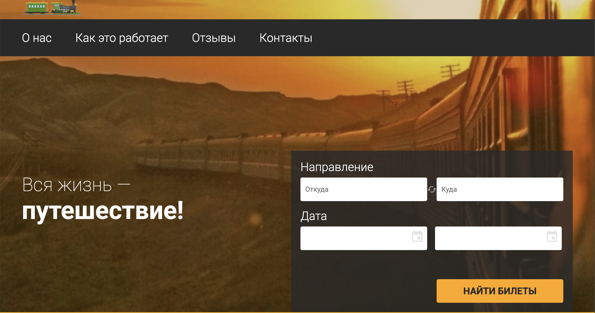
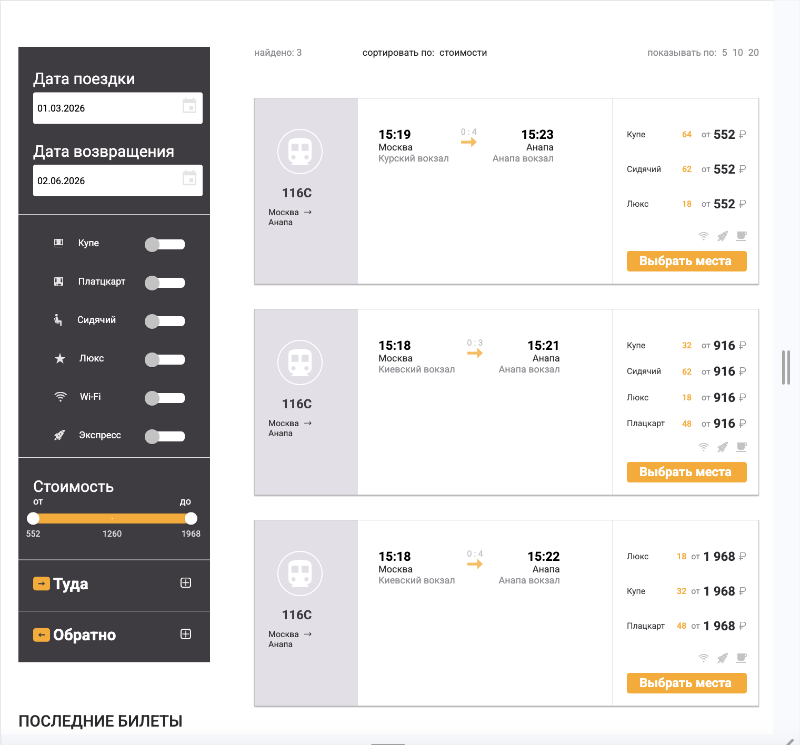
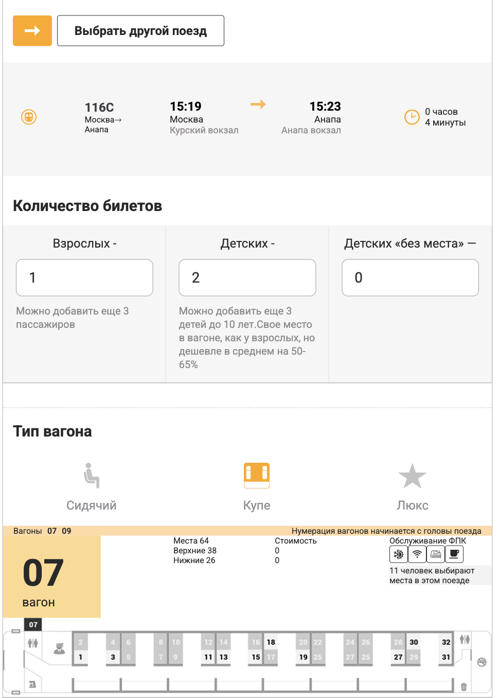
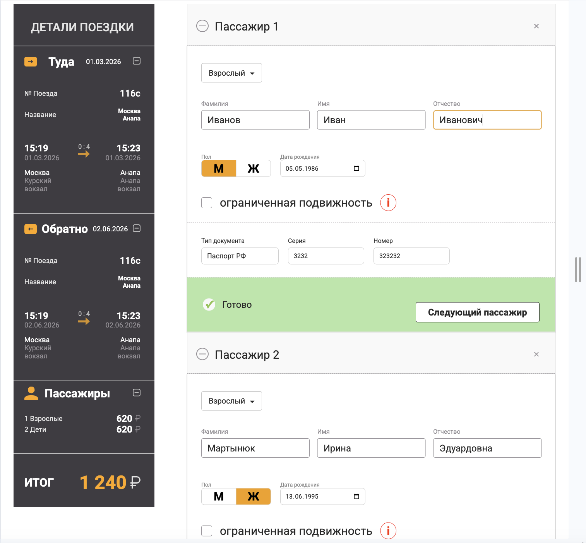
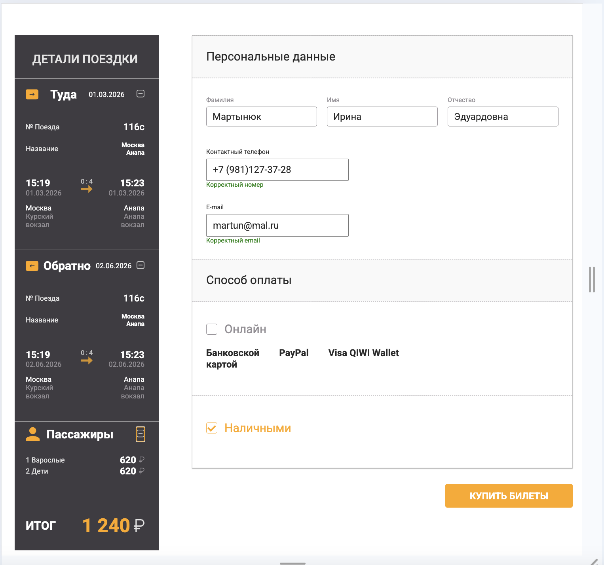
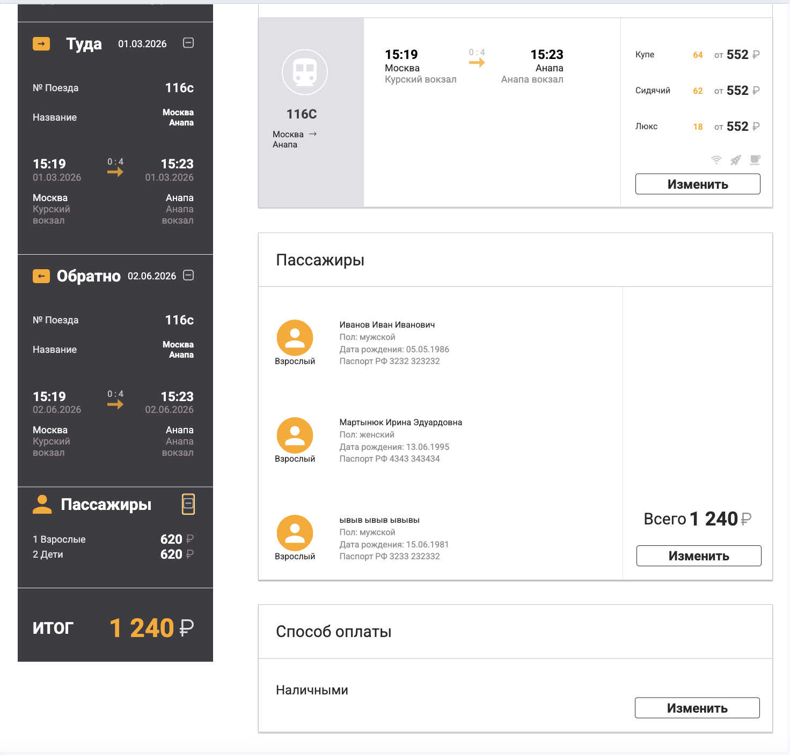

## Available Scripts

In the project directory, you can run:

### `npm start`
### `npm test`
### `npm run build`

### railway_service

**railway_service** is a graduation React project for searching and purchasing railway tickets.

## The project uses:

React (useState, useEffect, useContext, useNavigate)
React Router
localStorage
custom UI components
filters
react-datepicker library for date selection
MUI library for input switches
popup
loader

### Main Functionality

##  Ticket Search
- searching for tickets by destination and travel dates
- displaying the list of available trains
- filtering search results
- selecting a suitable train

##  Seat Selection
- selecting the type of carriage
- choosing seats

## Passenger Information
- full name
- gender
- date of birth
- document type
- passport or birth certificate

## Customer Information
- full name
- phone number
- email
- payment method

## Order Confirmation
- checking all entered data
- ability to edit entered information
- confirming the purchase

## Order Completion
- displaying information about the successfully completed order
- ability to return to the main page

## Screenshots

### Home Page

### Search Results

### Seat Selection

### Passenger Information

### Customer Information

### Order Confirmation

### Success Page

## The project includes validation of user data:

- full name validation
- phone number validation
- email validation
- date of birth validation
- passenger age validation
- validation of the selected document type